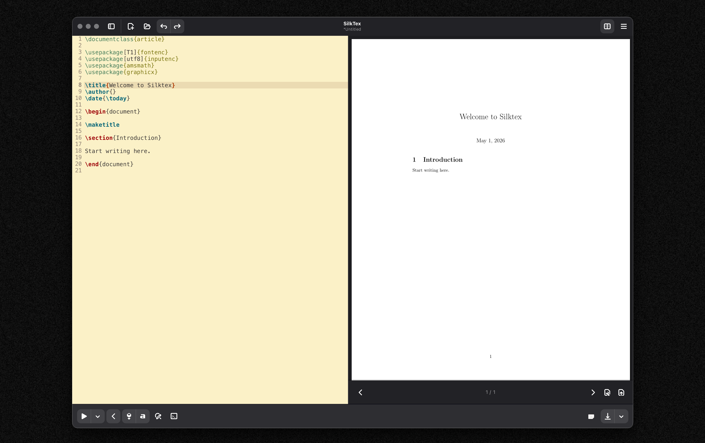

# SilkTex

A modern LaTeX editor for GNOME, built on GTK 4, libadwaita and Blueprint,
with a sharp PDF preview on HiDPI displays and a configurable snippet engine.


## Features

- GTK 4 / libadwaita UI
- Live PDF preview via Poppler, with device-scale aware rendering for
  crisp output on HiDPI displays
- Configurable snippet engine (two global modifier keys plus a letter) with
  `$1 $2 … $0` tab placeholders and `$FILENAME` / `$BASENAME` /
  `$SELECTED_TEXT` macros
- Document outline, search bar, SyncTeX forward/inverse sync
- BibTeX, `makeindex`, build-file cleanup, document statistics
- Preferences dialog with editor font, spell-check toggle, snippet editor
  and global shortcut keys

## Quick start — Nix development shell (recommended)

The repository ships a `flake.nix` that pins every build and runtime
dependency (GTK 4, libadwaita, gtksourceview 5, poppler-glib, TeX Live
full scheme, Adwaita / hicolor icon themes, blueprint-compiler, meson,
ninja, clang, gettext). The `run.sh` script wraps the common workflow:

```bash
git clone https://github.com/DERK0CHER/SilkTex.git
cd SilkTex

./run.sh              # incremental build + launch inside `nix develop`
./run.sh --clean      # wipe build-gtk4/, reconfigure, rebuild, launch
./run.sh --rebuild    # force meson reconfigure (after meson.build changes)
./run.sh -- file.tex  # forward arguments to silktex (anything after --)
./run.sh -h           # usage
```

If you prefer running the commands by hand:

```bash
nix develop --command meson setup build-gtk4
nix develop --command ninja -C build-gtk4
nix develop --command build-gtk4/src/silktex
```

The first `nix develop` invocation will download and cache the dev shell
(GNOME stack + TeX Live full scheme — a few GB the first time). Subsequent
launches reuse the cache.

### Requirements

- Nix with flakes enabled (`experimental-features = nix-command flakes`)
- macOS (Darwin / aarch64, x86_64) or any Linux distribution

No global GTK, Adwaita or LaTeX install is needed — everything is provided
by the flake.

## Building without Nix (Linux)

If you already have the GNOME stack installed system-wide:

```bash
# Required packages on recent Fedora, for reference:
sudo dnf install meson ninja-build clang pkgconf-pkg-config \
    gtk4-devel libadwaita-devel gtksourceview5-devel \
    poppler-glib-devel blueprint-compiler \
    adwaita-icon-theme gettext texlive-scheme-full

meson setup build
ninja -C build
./build/src/silktex
```

Debian/Ubuntu and Arch provide equivalent packages; the dependency list is
authoritative in `flake.nix`.

## Building a Flatpak

A GNOME Builder-friendly Flatpak manifest and helper script live in
[`flatpak/`](flatpak/). The default manifest builds the current checkout
against the GNOME 50 runtime and bundles the missing `poppler-glib`
dependency.

**Flatpak builds only run on Linux.** On macOS, develop with the Nix
shell above and run the Flatpak build on a Linux host / VM / CI job.

```bash
# One-time: install the runtime, SDK and TeX Live extension.
flatpak install --user flathub \
    org.gnome.Platform//50 \
    org.gnome.Sdk//50 \
    org.freedesktop.Sdk.Extension.texlive//25.08

# Clean build + install into the user's Flatpak repository:
./flatpak/build.sh

# Launch the installed Flatpak:
flatpak run app.silktex.SilkTex
# or, in one step:
./flatpak/build.sh --run

# Produce a distributable .flatpak bundle at ./app.silktex.SilkTex.flatpak :
./flatpak/build.sh --bundle
```

In GNOME Builder, open `flatpak/app.silktex.SilkTex.yml` and build/run it
as the Flatpak configuration.

The Flathub manifest at the repository root uses
`org.freedesktop.Sdk.Extension.texlive` for LaTeX tools. The development
manifest in `flatpak/` is intended for local GNOME Builder workflows.

## Project layout

```
data/
  ui/main.blp          libadwaita UI (Blueprint)
  snippets/            default snippet library
  icons/               app icon (hicolor)
  misc/                .desktop and AppStream metainfo
  templates/           default new-document template
flatpak/               Flatpak manifest + build script
src/
  application.c        GApplication subclass (startup / activate / open)
  window.c             main window, actions, tabs, accelerators
  editor.c             GtkSourceView-based editor widget
  compiler.c           pdflatex / bibtex / makeindex driver
  preview.c            Poppler-backed PDF preview (HiDPI aware)
  prefs.c              libadwaita preferences dialog
  snippets.c           snippet engine (modifiers + placeholders)
  structure.c          document outline
  searchbar.c          find / replace
  synctex.c            forward / inverse sync via the synctex CLI
  latex.c              Insert → {Image, Table, Matrix, Bibliography}
flake.nix              pinned dev shell + runtime env
run.sh                 build + launch wrapper around `nix develop`
meson.build            top-level meson project
```

## Development conventions

- C code is formatted by `clang-format` (see `.clang-format`).
- JSON / Markdown is formatted by `biome` (see `biome.jsonc`). To reformat
  everything:
  ```bash
  clang-format -i src/*.c src/*.h
  nix shell nixpkgs#biome --command biome format --write .
  ```
- `meson.build` targets `meson >= 0.62`, `c_std = gnu11`,
  `warning_level = 2`. GObject-idiomatic warnings (short-form
  `GActionEntry` arrays, fixed-signature GTK callbacks) are silenced
  project-wide via `-Wno-missing-field-initializers` and
  `-Wno-unused-parameter`.
- Default Git branch: `master`.

## License

SilkTex is licensed under the GNU General Public License, version 3 or
later. See [`COPYING`](COPYING) for the full text.

Author: Bela Georg Barthelmes.

## Credits

Thanks to the GNOME, GTK, libadwaita and gtksourceview projects for the
platform this is built on.
